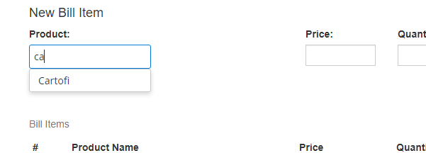

[](https://travis-ci.org/fagot013/bear-spendings)
# bear-spendings
Simple app that monitor bear spendings. 

- [Versions](#versions)
- [Technologies](#technologies)
- [Dev process](#dev-process)


## Versions 

### Version 0.3
- Moved build to java 11
- Suggestion of product list
- Separate api call for url
- Select today date by default in add new bill form UI

How it looks :)




### Version 0.2
 - Cost per unit of bill item
 - Bill total on 'Add bill' form
 
How it looks :)


### Version 0.1
 - Simple display home page
 - Add new bill form
 - List fo bills (including bill items)


#### Simple home page
    A welcome page for the user. Nothing fancy. Wil be enhanced in upcoming version
#### Add new bill form
    The main scope of app is to create an easy way to introduce bill. First implementation will be simple, but
    is going to cover the main case.

   Example
   * select bill date
   * provide a store
   * a list of top products from selected store is displayed
   * select one of top product. Bill item form will be populated with product name and price, quantity set to 1.
   User can edit all these fields.
   * add bill items to the bill.
    

## Technologies
On UI side angular 6 is used. Server side will be implemented with spring boot 2.0
H2 database will be used for this version
In memory authentication wil be enough with hardcoded user name and password.

##Dev process

### Run build with no UI test
UI test take some times to execute. There are cases when it is necessary to run build without them.
For this case run following command:
```shell script
gradlew clean build -Dskip.ui.test=true
``` 

In order to build only sping app without invoking angular build use following command:
```shell script
gradlew clean build -Dskip.ui.test=true -Dskip.ui.build=true
```
### How to perform release
Gradle release plugin is added to root project.
Angular ui version is not incremented by this plugin. Manual version change must be perfomed.
Steps to perform a release:
1. run ```gradle release``` from root project
2. update version of angular ui app in angular-ui package.json version property. push changes to git.


### Update version on oracle cloud

1. checkout tag version with git (ex: 0.0.2)
2. gradle clean build
3. upload jar to oracle cloud
4. rename old jar - start-up script is looking for following pattern `bear-spendings-*.jar`.
The script need to enhanced. 
5. stop application
6. start application
 